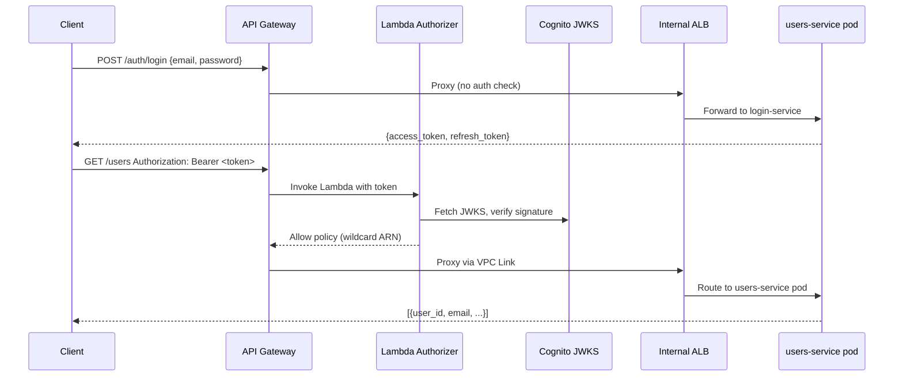
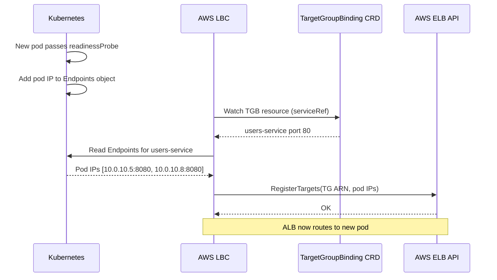
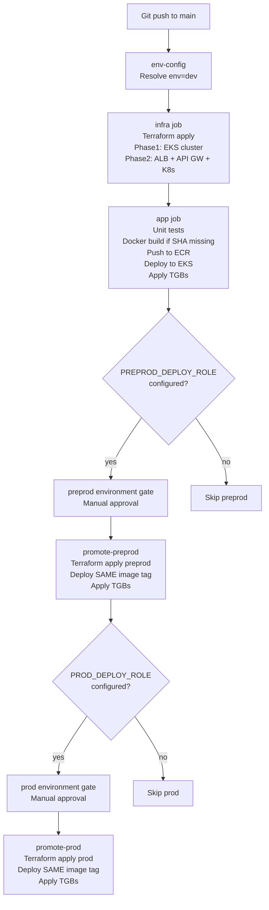
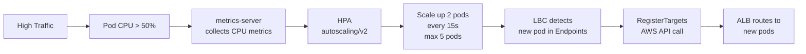

# AnyCompany Users Service

A serverless-style Users REST API built on EKS with JWT authentication, deployed to AWS via Terraform and GitHub Actions.

---

## Table of Contents

- [Architecture Overview](#architecture-overview)
- [System Flowcharts](#system-flowcharts)
- [Technology Stack](#technology-stack)
- [Repository Structure](#repository-structure)
- [Prerequisites](#prerequisites)
- [Manual Deployment Guide](#manual-deployment-guide)
- [CI/CD Pipeline](#cicd-pipeline)
- [API Reference](#api-reference)
- [Architectural Approaches & Trade-offs](#architectural-approaches--trade-offs)
- [Troubleshooting Guide](#troubleshooting-guide)

---

## Architecture Overview

```
Internet
    │
    ▼
Amazon API Gateway (REST)        ← Public HTTPS endpoint
    │   Lambda Token Authorizer  ← JWT validation via Cognito JWKS
    │
    │  VPC Link (private tunnel)
    ▼
Internal ALB                     ← Path-based routing inside VPC
  /auth/*  ──► Login Target Group  ──► login-service pods  (EKS)
  /users/* ──► Users Target Group  ──► users-service pods  (EKS)
                    ▲                          ▲
           TargetGroupBinding         TargetGroupBinding
           (AWS LBC registers         (AWS LBC registers
            pod IPs automatically)     pod IPs automatically)
    │
    ▼
Amazon DynamoDB                  ← Users table (PAY_PER_REQUEST)
Amazon Cognito User Pool         ← Auth / token issuance
Amazon ECR                       ← Container image registry
```

### Per-Environment Isolation

Each environment (`dev`, `preprod`, `prod`) is a fully independent stack:

| Resource | dev | preprod | prod |
|---|---|---|---|
| EKS cluster | anycompany-users-dev-cluster | anycompany-users-preprod-cluster | anycompany-users-prod-cluster |
| DynamoDB table | anycompany-users-dev-users | anycompany-users-preprod-users | anycompany-users-prod-users |
| Cognito User Pool | anycompany-users-dev-pool | anycompany-users-preprod-pool | anycompany-users-prod-pool |
| API Gateway | anycompany-users-dev-api | anycompany-users-preprod-api | anycompany-users-prod-api |
| ECR repos | shared (dev) | ← same | ← same |

---

## System Flowcharts

### Request Authentication Flow



### TargetGroupBinding Pod Registration Flow



### CI/CD Pipeline Flow



### HPA Scaling Flow



---

## Technology Stack

| Component | Technology | Version |
|---|---|---|
| IaC | Terraform | ~1.7 |
| Language | Python | 3.10 |
| Compute | Amazon EKS | 1.31 |
| Node type | EC2 t3.medium | managed node group |
| Database | Amazon DynamoDB | on-demand |
| API | Amazon API Gateway REST (v1) | — |
| Auth | Amazon Cognito + Lambda Authorizer | — |
| Load Balancer | AWS ALB (internal) | — |
| LB Controller | AWS Load Balancer Controller | 1.8.1 (Helm) |
| Container Registry | Amazon ECR | — |
| Networking | VPC Gateway Endpoints (S3, DynamoDB) | — |
| Autoscaling | HPA autoscaling/v2 | min:2 max:5 |

---

## Repository Structure

```
.
├── .github/workflows/deploy.yml     # CI/CD pipeline
├── infrastructure/
│   ├── shared/                      # Shared VPC, NAT GWs, VPC endpoints, GitHub OIDC
│   │   ├── vpc.tf
│   │   ├── github-oidc.tf
│   │   ├── main.tf
│   │   └── variables.tf
│   └── env/                         # Per-environment stack (instantiated once per env)
│       ├── eks.tf                   # EKS cluster + node group + OIDC
│       ├── alb.tf                   # ALB + Target Groups + Listener Rules
│       ├── api-gateway.tf           # API Gateway + OpenAPI body + Lambda integration
│       ├── cognito.tf               # Cognito User Pool + App Client
│       ├── dynamodb.tf              # DynamoDB users table
│       ├── ecr.tf                   # ECR repos (dev only, shared across envs)
│       ├── lambda-authorizer.tf     # Lambda token authorizer + IAM
│       ├── lbc.tf                   # AWS LBC Helm release + IRSA role
│       ├── vpc-link.tf              # VPC Link V2 connecting API GW to ALB
│       ├── iam.tf                   # IRSA roles for services
│       ├── k8s-infra.tf             # K8s namespaces + ConfigMaps via Terraform
│       └── environments/            # Per-env tfvars
│           ├── dev.tfvars
│           ├── preprod.tfvars
│           ├── prod.tfvars
│           └── mr.tfvars
├── k8s/
│   ├── login-deployment.yaml        # Login service Deployment (IMAGE_TAG placeholder)
│   ├── login-service.yaml           # Login service Service (NodePort)
│   ├── login-tgb.yaml               # Login TargetGroupBinding (LOGIN_TG_ARN placeholder)
│   ├── login-hpa.yaml               # Login HPA (min:2 max:5 CPU 50%)
│   ├── users-deployment.yaml        # Users service Deployment
│   ├── users-service.yaml           # Users service Service (NodePort)
│   ├── users-tgb.yaml               # Users TargetGroupBinding
│   └── users-hpa.yaml               # Users HPA
└── src/
    ├── login/                       # FastAPI login service
    ├── users/                       # FastAPI users service
    └── authorizer/                  # Lambda token authorizer (Python)
        ├── lambda_authorizer.py
        └── requirements.txt
```

---

## Prerequisites

### Tools

```bash
# Terraform
terraform -version   # requires ~1.7

# AWS CLI
aws --version        # requires v2

# kubectl
kubectl version --client

# Helm
helm version

# Docker
docker --version

# Python
python3 --version    # requires 3.10+
```

### AWS Credentials

```bash
# Configure AWS profile
aws configure --profile anycompany

# Or assume role directly
aws sts assume-role \
  --role-arn arn:aws:iam::ACCOUNT_ID:role/anycompany-users-github-nonprod-deploy \
  --role-session-name manual-deploy

# Verify identity
aws sts get-caller-identity
```

### Shared Infrastructure (one-time setup)

The shared VPC, NAT Gateways, and VPC Endpoints must be applied once before any environment:

```bash
cd infrastructure/shared

terraform init
terraform plan
terraform apply
```

---

## Manual Deployment Guide

### Step 1 — Bootstrap Terraform backend (first time only)

```bash
# Create S3 bucket for state
aws s3 mb s3://anycompany-users-tfstate-ACCOUNT_ID --region us-east-1

# Enable versioning
aws s3api put-bucket-versioning \
  --bucket anycompany-users-tfstate-ACCOUNT_ID \
  --versioning-configuration Status=Enabled
```

### Step 2 — Set environment variable

```bash
export ENV=dev          # or preprod | prod
export AWS_REGION=us-east-1
export TF_DIR=infrastructure/env
export TF_STATE_BUCKET=anycompany-users-tfstate-ACCOUNT_ID
```

### Step 3 — Build Lambda authorizer package

```bash
BUILD_DIR="/tmp/authorizer-build"
ZIP_PATH="/tmp/anycompany-authorizer-${ENV}.zip"

rm -rf "${BUILD_DIR}" && mkdir -p "${BUILD_DIR}"
pip install -r src/authorizer/requirements.txt -t "${BUILD_DIR}"
cp src/authorizer/lambda_authorizer.py "${BUILD_DIR}/"
cd "${BUILD_DIR}" && zip -qr "${ZIP_PATH}" .
cd -
echo "Built: $(du -sh ${ZIP_PATH})"
```

### Step 4 — Terraform Phase 1: EKS cluster

```bash
cd ${TF_DIR}

terraform init -reconfigure \
  -backend-config="key=${ENV}/terraform.tfstate" \
  -backend-config="bucket=${TF_STATE_BUCKET}" \
  -backend-config="region=${AWS_REGION}"

# Get existing cluster endpoint if cluster already exists
EKS_CLUSTER="anycompany-users-${ENV}-cluster"
EKS_ENDPOINT=$(aws eks describe-cluster --name "${EKS_CLUSTER}" \
  --query 'cluster.endpoint' --output text 2>/dev/null || echo "")
EKS_CA=$(aws eks describe-cluster --name "${EKS_CLUSTER}" \
  --query 'cluster.certificateAuthority.data' --output text 2>/dev/null || echo "")

terraform apply \
  -var-file=environments/${ENV}.tfvars \
  -var="env=${ENV}" \
  -var="eks_cluster_endpoint=${EKS_ENDPOINT}" \
  -var="eks_cluster_ca_cert=${EKS_CA}" \
  -target=aws_iam_role.eks_cluster \
  -target=aws_iam_role.eks_nodes \
  -target=aws_iam_role_policy_attachment.eks_cluster_policy \
  -target=aws_iam_role_policy_attachment.eks_worker_node \
  -target=aws_iam_role_policy_attachment.eks_cni \
  -target=aws_iam_role_policy_attachment.eks_ecr_read \
  -target=aws_eks_cluster.main \
  -target=aws_eks_node_group.main \
  -target=aws_iam_openid_connect_provider.eks \
  -auto-approve
```

### Step 5 — Wait for EKS to be ACTIVE

```bash
aws eks wait cluster-active --name "anycompany-users-${ENV}-cluster" --region ${AWS_REGION}
echo "EKS cluster is ready"
```

### Step 6 — Terraform Phase 2: ALB, API Gateway, K8s infra

```bash
EKS_ENDPOINT=$(aws eks describe-cluster --name "anycompany-users-${ENV}-cluster" \
  --query 'cluster.endpoint' --output text)
EKS_CA=$(aws eks describe-cluster --name "anycompany-users-${ENV}-cluster" \
  --query 'cluster.certificateAuthority.data' --output text)

terraform apply \
  -var-file=environments/${ENV}.tfvars \
  -var="env=${ENV}" \
  -var="eks_cluster_endpoint=${EKS_ENDPOINT}" \
  -var="eks_cluster_ca_cert=${EKS_CA}" \
  -auto-approve

cd -
```

### Step 7 — Configure kubectl

```bash
aws eks update-kubeconfig \
  --name "anycompany-users-${ENV}-cluster" \
  --region ${AWS_REGION}

# Verify
kubectl get nodes
```

### Step 8 — Build and push Docker images

```bash
# Log in to ECR
aws ecr get-login-password --region ${AWS_REGION} \
  | docker login --username AWS --password-stdin \
    "$(aws sts get-caller-identity --query Account --output text).dkr.ecr.${AWS_REGION}.amazonaws.com"

# Image tag = git SHA (shared across all envs — build once, promote tag)
IMAGE_TAG=$(git rev-parse --short=8 HEAD)

LOGIN_ECR=$(aws ecr describe-repositories \
  --repository-names anycompany-login-service \
  --query 'repositories[0].repositoryUri' --output text)
USERS_ECR=$(aws ecr describe-repositories \
  --repository-names anycompany-users-service \
  --query 'repositories[0].repositoryUri' --output text)

docker build -t "${LOGIN_ECR}:${IMAGE_TAG}" src/login/
docker push "${LOGIN_ECR}:${IMAGE_TAG}"

docker build -t "${USERS_ECR}:${IMAGE_TAG}" src/users/
docker push "${USERS_ECR}:${IMAGE_TAG}"

echo "Pushed images with tag: ${IMAGE_TAG}"
```

### Step 9 — Deploy to Kubernetes

```bash
NS="anycompany-users-${ENV}"

# Deploy workloads
sed "s|IMAGE_TAG|${LOGIN_ECR}:${IMAGE_TAG}|g" k8s/login-deployment.yaml \
  | kubectl apply -n "${NS}" -f -
sed "s|IMAGE_TAG|${USERS_ECR}:${IMAGE_TAG}|g" k8s/users-deployment.yaml \
  | kubectl apply -n "${NS}" -f -

# Apply services and autoscalers
kubectl apply -n "${NS}" -f k8s/login-service.yaml
kubectl apply -n "${NS}" -f k8s/users-service.yaml
kubectl apply -n "${NS}" -f k8s/login-hpa.yaml
kubectl apply -n "${NS}" -f k8s/users-hpa.yaml

# Wait for rollout
kubectl rollout status deployment/login-service -n "${NS}" --timeout=5m
kubectl rollout status deployment/users-service -n "${NS}" --timeout=5m
```

### Step 10 — Apply TargetGroupBindings

```bash
PREFIX="anycompany-users-${ENV}"

LOGIN_TG_ARN=$(aws elbv2 describe-target-groups \
  --names "${PREFIX}-login-tg" \
  --query 'TargetGroups[0].TargetGroupArn' --output text)
USERS_TG_ARN=$(aws elbv2 describe-target-groups \
  --names "${PREFIX}-users-tg" \
  --query 'TargetGroups[0].TargetGroupArn' --output text)

# Wait for LBC CRDs to be available
until kubectl get crd targetgroupbindings.elbv2.k8s.aws &>/dev/null; do
  echo "Waiting for TargetGroupBinding CRD..."; sleep 5
done

sed "s|LOGIN_TG_ARN|${LOGIN_TG_ARN}|g" k8s/login-tgb.yaml | kubectl apply -n "${NS}" -f -
sed "s|USERS_TG_ARN|${USERS_TG_ARN}|g" k8s/users-tgb.yaml | kubectl apply -n "${NS}" -f -

# Verify targets are healthy
echo "Checking login TG health..."
aws elbv2 describe-target-health --target-group-arn "${LOGIN_TG_ARN}" \
  --query 'TargetHealthDescriptions[*].{IP:Target.Id,Port:Target.Port,State:TargetHealth.State}'

echo "Checking users TG health..."
aws elbv2 describe-target-health --target-group-arn "${USERS_TG_ARN}" \
  --query 'TargetHealthDescriptions[*].{IP:Target.Id,Port:Target.Port,State:TargetHealth.State}'
```

### Step 11 — Create a test user in Cognito

```bash
USER_POOL_ID=$(aws cognito-idp list-user-pools --max-results 20 \
  --query "UserPools[?Name=='anycompany-users-${ENV}-pool'].Id" --output text)

aws cognito-idp admin-create-user \
  --user-pool-id "${USER_POOL_ID}" \
  --username testuser@example.com \
  --temporary-password "Temp1234!" \
  --user-attributes Name=email,Value=testuser@example.com Name=email_verified,Value=true

aws cognito-idp admin-set-user-password \
  --user-pool-id "${USER_POOL_ID}" \
  --username testuser@example.com \
  --password "Test1234!" \
  --permanent
```

### Step 12 — End-to-end smoke test

```bash
# Get API Gateway URL
API_URL=$(aws apigateway get-rest-apis \
  --query "items[?name=='anycompany-users-${ENV}-api'].id" --output text)
BASE_URL="https://${API_URL}.execute-api.${AWS_REGION}.amazonaws.com/${ENV}"

APP_CLIENT_ID=$(aws cognito-idp list-user-pool-clients \
  --user-pool-id "${USER_POOL_ID}" --max-results 1 \
  --query 'UserPoolClients[0].ClientId' --output text)

# Login
TOKEN=$(curl -s -X POST "${BASE_URL}/auth/login" \
  -H "Content-Type: application/json" \
  -d "{\"email\":\"testuser@example.com\",\"password\":\"Test1234!\",\"client_id\":\"${APP_CLIENT_ID}\"}" \
  | python3 -c "import sys,json; print(json.load(sys.stdin)['access_token'])")

echo "Got token: ${TOKEN:0:20}..."

# Create user
curl -s -X POST "${BASE_URL}/users" \
  -H "Authorization: Bearer ${TOKEN}" \
  -H "Content-Type: application/json" \
  -d '{"email":"alice@example.com","name":"Alice"}' | python3 -m json.tool

# List users
curl -s "${BASE_URL}/users" -H "Authorization: Bearer ${TOKEN}" | python3 -m json.tool
```

### Promote image to preprod (without rebuilding)

```bash
# The same IMAGE_TAG from dev is deployed — no docker operations needed
export ENV=preprod

# Steps 4-6 and 9-10 above with ENV=preprod
# Uses same IMAGE_TAG (git SHA) — ECR image is already there from dev build
```

---

## CI/CD Pipeline

The GitHub Actions workflow (`.github/workflows/deploy.yml`) automates the full deploy:

| Job | Trigger | Description |
|---|---|---|
| `env-config` | always | Resolves `env` and `tfvars_file` from branch/PR |
| `infra` | push/PR | Terraform apply (2 phases) |
| `app` | after infra | Unit tests → ECR build → EKS deploy → TGBs |
| `check-preprod` | after app | Checks if `PREPROD_DEPLOY_ROLE_ARN` secret exists |
| `promote-preprod` | manual gate | Terraform + same image deploy to preprod |
| `check-prod` | after preprod | Checks if `PROD_DEPLOY_ROLE_ARN` secret exists |
| `promote-prod` | manual gate | Terraform + same image deploy to prod |
| `teardown-mr` | PR closed | `terraform destroy` for MR ephemeral env |

### Required GitHub Secrets

| Secret | Description |
|---|---|
| `NONPROD_DEPLOY_ROLE_ARN` | IAM role for dev/MR deploys |
| `TF_STATE_BUCKET` | S3 bucket for dev/MR Terraform state |
| `PREPROD_DEPLOY_ROLE_ARN` | IAM role for preprod (optional — skips preprod if absent) |
| `PREPROD_TF_STATE_BUCKET` | S3 bucket for preprod state |
| `PROD_DEPLOY_ROLE_ARN` | IAM role for prod (optional — skips prod if absent) |
| `PROD_TF_STATE_BUCKET` | S3 bucket for prod state |

---

## API Reference

All protected endpoints require `Authorization: Bearer <access_token>` header.

| Method | Path | Auth | Description |
|---|---|---|---|
| POST | `/auth/login` | None | Login with email + password, returns tokens |
| POST | `/auth/refresh` | None | Refresh access token |
| POST | `/auth/logout` | None | Invalidate refresh token |
| GET | `/users` | Required | List users (supports `limit`, `next_token`) |
| POST | `/users` | Required | Create user |
| GET | `/users/{user_id}` | Required | Get user by ID |
| PUT | `/users/{user_id}` | Required | Update user |
| DELETE | `/users/{user_id}` | Required | Delete user |

---

## Architectural Approaches & Trade-offs

### Load Balancing: Three Options

#### Option A — Current: AWS ALB + TargetGroupBinding (recommended for AWS-only)

```
API Gateway → VPC Link → ALB → pods (via TGB IP registration)
```

- AWS LBC watches TargetGroupBinding CRDs and calls `RegisterTargets` / `DeregisterTargets` as pods come and go
- ALB is fully managed by AWS (no sidecar pods)
- Tight AWS integration: ACM certificates, WAF, access logs, cross-zone LB
- Path-based routing defined in Terraform (ALB listener rules)
- **Limitation:** AWS-only; advanced traffic policies (retries, circuit breaking) require ALB annotations

#### Option B — AWS LBC + Gateway API (future-proof AWS path)

```
API Gateway → VPC Link → ALB (managed by K8s Gateway API HTTPRoute) → pods
```

- Same ALB data plane, but routing configured via standard K8s `HTTPRoute` resources instead of Terraform
- Kubernetes Ingress API is frozen; Gateway API is the official successor
- AWS LBC v2.7+ supports Gateway API natively
- Aligns with K8s ecosystem direction without giving up AWS integration

```yaml
apiVersion: gateway.networking.k8s.io/v1
kind: HTTPRoute
metadata:
  name: anycompany-routes
spec:
  parentRefs:
    - name: anycompany-gateway
  rules:
    - matches:
        - path: { type: PathPrefix, value: /users }
      backendRefs:
        - name: users-service
          port: 80
```

#### Option C — Envoy Gateway (cloud-portable)

```
API Gateway → VPC Link → NLB → Envoy Gateway pods → pods
```

- Implements Gateway API spec with full traffic management: weight-based routing, retries, circuit breaking, timeouts via `BackendTrafficPolicy`
- Cloud-portable: same manifests on GKE, AKS, or on-prem
- Requires running Envoy pods (~256Mi/pod × 2) and an NLB for VPC Link
- Operational overhead: xDS config debugging, Envoy version management

| Factor | ALB + TGB | ALB + Gateway API | Envoy Gateway |
|---|---|---|---|
| AWS integration | Native | Native | Manual |
| K8s standard | Legacy Ingress | Gateway API | Gateway API |
| Advanced traffic control | Annotations only | Partial | Full (policies) |
| Operational overhead | Low | Low | Medium |
| Cloud portability | AWS only | AWS only | Any cloud |
| Extra compute cost | None | None | ~512Mi/node |

### NAT Gateway: Three Options

| Option | Cost | AZ Fault Tolerance | Current |
|---|---|---|---|
| Single-AZ NAT | Lowest ($) | No — AZ-b traffic crosses AZ | No |
| Per-AZ Zonal NATs | 2× cost | Yes — each AZ uses local NAT | **Yes** |
| AWS Regional NAT | Same as zonal | Yes (managed by AWS) | Not yet (Terraform provider support pending) |

### DynamoDB: Capacity Modes

| Mode | Use case | Current |
|---|---|---|
| PAY_PER_REQUEST | Unpredictable / spiky traffic | **Yes** |
| PROVISIONED + Auto Scaling | Stable, high-volume traffic | No |
| PROVISIONED + DAX | Microsecond read latency needed | No |

---

## Troubleshooting Guide

### 1. TGB pods not registering — `BackendNotFound: unable to find port 8080 on service`

**Symptom:** `kubectl describe targetgroupbinding -n <ns>` shows BackendNotFound error. ALB target group shows no healthy targets.

**Root cause:** `targetgroupbindings.spec.serviceRef.port` must match the Service's `spec.ports[].port` value (the Service port), not the pod's `containerPort`.

**Resolution:**
```yaml
# WRONG — 8080 is the pod port, not the Service port
spec:
  serviceRef:
    port: 8080

# CORRECT — 80 is the Service's port field
spec:
  serviceRef:
    port: 80
```

```bash
# Verify Service port
kubectl get svc users-service -n <ns> -o jsonpath='{.spec.ports[*].port}'
# Should output: 80
```

---

### 2. GET /users returns 403 after successful POST /auth/login

**Symptom:** POST /auth/login works (200), but subsequent GET /users returns 403 `no identity-based policy allows execute-api:Invoke`. Starts working after ~5 minutes.

**Root cause:** Lambda authorizer had `authorizerResultTtlInSeconds: 300`. The cached IAM policy was scoped to the exact `methodArn` of the first request (e.g., `POST /users`). API Gateway reused that cached policy for `GET /users` and the method ARN didn't match → 403.

**Resolution:** Return a wildcard ARN covering all methods in the stage:
```python
# WRONG — caches a policy for only one method
return _generate_policy("user", "Allow", event["methodArn"])

# CORRECT — policy covers all methods in the API stage
method_arn = event["methodArn"]
arn_parts = method_arn.split(":")
api_stage = "/".join(arn_parts[5].split("/")[:2])
wildcard_arn = ":".join(arn_parts[:5]) + ":" + api_stage + "/*"
return _generate_policy("user", "Allow", wildcard_arn)
```

---

### 3. GET/PUT/DELETE /users/{user_id} returns 500 InternalServerErrorException

**Symptom:** Path parameter routes return 500 from API Gateway. POST /users (no path param) works fine.

**Root cause:** API Gateway HTTP_PROXY integration with VPC Link does not automatically substitute `{user_id}` in the integration URI. Without explicit `requestParameters` mapping, the literal string `{user_id}` is forwarded to the ALB.

**Resolution:** Add `requestParameters` to every integration that uses a path parameter:
```hcl
"x-amazon-apigateway-integration" = {
  type       = "HTTP_PROXY"
  httpMethod = "GET"
  uri        = "http://${aws_lb.alb.dns_name}/users/{user_id}"
  ...
  requestParameters = {
    "integration.request.path.user_id" = "method.request.path.user_id"
  }
}
```

---

### 4. Login returns 401 Invalid credentials after Cognito user creation

**Symptom:** User exists in Cognito but login returns 401. User was created with `admin-create-user` (temporary password).

**Root cause:** `admin-create-user` puts the user in `FORCE_CHANGE_PASSWORD` state. The temporary password cannot be used for `USER_PASSWORD_AUTH` flow.

**Resolution:** Set a permanent password immediately after creating the user:
```bash
aws cognito-idp admin-set-user-password \
  --user-pool-id <POOL_ID> \
  --username testuser@example.com \
  --password "Test1234!" \
  --permanent
```

---

### 5. ECR `PutImageTagMutability` AccessDeniedException

**Symptom:** Terraform apply fails: `operation error ECR: PutImageTagMutability ... AccessDeniedException`

**Root cause:** The GitHub Actions deploy IAM role was missing `ecr:PutImageTagMutability` permission. Required when changing `image_tag_mutability` via Terraform.

**Resolution:** Add to the nonprod deploy role IAM policy (`infrastructure/shared/github-oidc.tf`):
```hcl
"ecr:PutImageTagMutability",
```
Then apply `infrastructure/shared`:
```bash
cd infrastructure/shared && terraform apply
```

---

### 6. HPA not scaling — `unable to get metrics for resource cpu`

**Symptom:** `kubectl describe hpa users-service-hpa` shows `unknown` for current CPU. HPA never scales.

**Root cause:** Either (a) metrics-server is not installed, or (b) pods have no `resources.requests.cpu` set.

**Resolution:**
```bash
# Check if metrics-server is running
kubectl get pods -n kube-system | grep metrics-server

# If missing, install it
kubectl apply -f https://github.com/kubernetes-sigs/metrics-server/releases/latest/download/components.yaml

# On EKS, add kubelet address flag (nodes use internal IPs)
kubectl patch deployment metrics-server -n kube-system \
  --type='json' \
  -p='[{"op":"add","path":"/spec/template/spec/containers/0/args/-","value":"--kubelet-preferred-address-types=InternalIP"}]'

# Verify pods have resource requests
kubectl get deployment users-service -n <ns> -o jsonpath='{.spec.template.spec.containers[0].resources}'
```

Ensure `resources.requests.cpu` is set in the deployment manifest:
```yaml
resources:
  requests:
    cpu: "250m"
    memory: "256Mi"
  limits:
    cpu: "500m"
    memory: "512Mi"
```

---

### 7. Terraform fails — EKS Kubernetes resources before cluster is ready

**Symptom:** Phase 2 Terraform apply fails because Kubernetes provider can't connect: `dial tcp: connection refused`

**Root cause:** Terraform tries to create K8s resources (namespaces, ConfigMaps) before EKS cluster is ACTIVE. The two-phase apply pattern exists to solve this.

**Resolution:** Always run Phase 1 (EKS only) first, wait for ACTIVE, then run Phase 2:
```bash
aws eks wait cluster-active --name "anycompany-users-${ENV}-cluster"
# Then run full terraform apply for Phase 2
```

---

### 8. VPC Link — ALB not reachable from API Gateway

**Symptom:** All API calls return 503 Service Unavailable from API Gateway.

**Root cause:** ALB security group does not allow inbound from VPC Link security group.

**Diagnosis:**
```bash
# Check ALB security group rules
aws ec2 describe-security-groups \
  --filters "Name=group-name,Values=anycompany-users-${ENV}-alb-sg" \
  --query 'SecurityGroups[0].IpPermissions'

# Check VPC Link security group
aws ec2 describe-security-groups \
  --filters "Name=group-name,Values=anycompany-users-${ENV}-vpc-link-sg"
```

The ALB SG must have an ingress rule allowing port 80 from the VPC Link SG.

---

### 9. Verify S3/DynamoDB traffic goes through VPC endpoints (not NAT)

**Method 1 — Check route table for prefix list entries:**
```bash
RT_ID=$(aws ec2 describe-route-tables \
  --filters "Name=tag:Name,Values=anycompany-nonprod-private-rt-a" \
  --query 'RouteTables[0].RouteTableId' --output text)

aws ec2 describe-route-tables --route-table-ids "${RT_ID}" \
  --query 'RouteTables[0].Routes[?DestinationPrefixListId!=null]'
# Should show pl-XXXXX (S3) and pl-YYYYY (DynamoDB) routes
```

**Method 2 — NAT Gateway bytes metric should NOT spike on DynamoDB/S3 calls:**
```bash
aws cloudwatch get-metric-statistics \
  --namespace AWS/NatGateway \
  --metric-name BytesOutToDestination \
  --dimensions Name=NatGatewayId,Value=<NAT_GW_ID> \
  --start-time $(date -u -d '5 minutes ago' +%FT%TZ) \
  --end-time $(date -u +%FT%TZ) \
  --period 60 --statistics Sum
```

**Method 3 — VPC Endpoint CloudWatch metric BytesProcessed should increase:**
```bash
aws cloudwatch get-metric-statistics \
  --namespace AWS/VPC \
  --metric-name BytesProcessed \
  --dimensions Name=VpcEndpointId,Value=<ENDPOINT_ID> \
  --start-time $(date -u -d '5 minutes ago' +%FT%TZ) \
  --end-time $(date -u +%FT%TZ) \
  --period 60 --statistics Sum
```

**Method 4 — Resolve DynamoDB DNS inside a pod (should resolve to private IP):**
```bash
kubectl run -it --rm debug --image=busybox --restart=Never -- \
  nslookup dynamodb.us-east-1.amazonaws.com
# Expected: resolves to 10.x.x.x (VPC endpoint IP, not public IP)
```

---

### 10. Stress test HPA — load not triggering scale-up

**Symptom:** External load test (curl/Python from laptop through API Gateway) shows CPU at 50-55% but pods don't scale.

**Root cause:** Network round-trip time dominates. Pods spend time waiting for I/O, not consuming CPU. CPU never sustainably exceeds threshold.

**Resolution:** Run load generator inside the cluster to eliminate network latency:
```bash
# Create load generator pod
kubectl run -n anycompany-users-dev load-test --image=busybox --restart=Never -- \
  /bin/sh -c "while true; do wget -qO- http://users-service/users; done"

# Watch HPA
kubectl get hpa -n anycompany-users-dev -w

# Watch pod count
kubectl get pods -n anycompany-users-dev -w

# Clean up
kubectl delete pod load-test -n anycompany-users-dev
```

---

### General Diagnostic Commands

```bash
# Pod status
kubectl get pods -n anycompany-users-dev

# Pod logs
kubectl logs -n anycompany-users-dev -l app=users-service --tail=50

# TGB status
kubectl describe targetgroupbinding users-tgb -n anycompany-users-dev

# HPA status
kubectl describe hpa users-service-hpa -n anycompany-users-dev

# ALB target health
aws elbv2 describe-target-health \
  --target-group-arn $(aws elbv2 describe-target-groups \
    --names anycompany-users-dev-users-tg \
    --query 'TargetGroups[0].TargetGroupArn' --output text)

# API Gateway logs (enable execution logging first)
aws logs tail /aws/apigateway/anycompany-users-dev --follow

# Lambda authorizer logs
aws logs tail /aws/lambda/anycompany-users-dev-token-authorizer --follow
```
