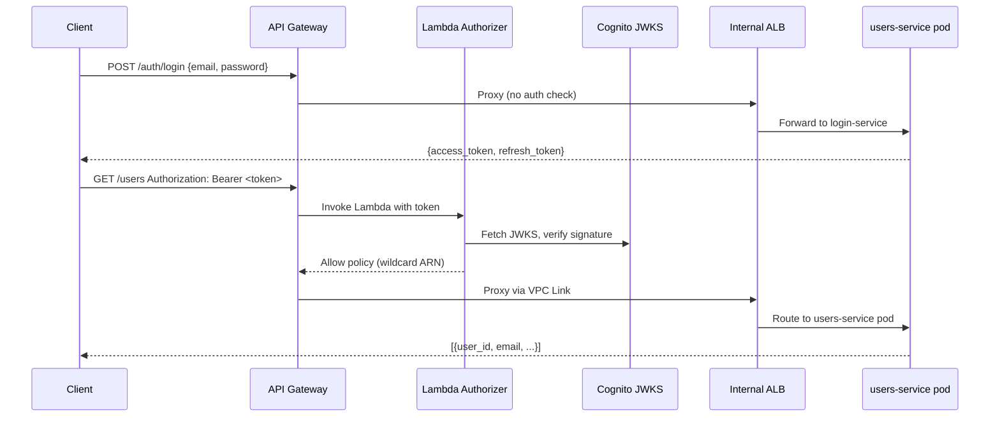
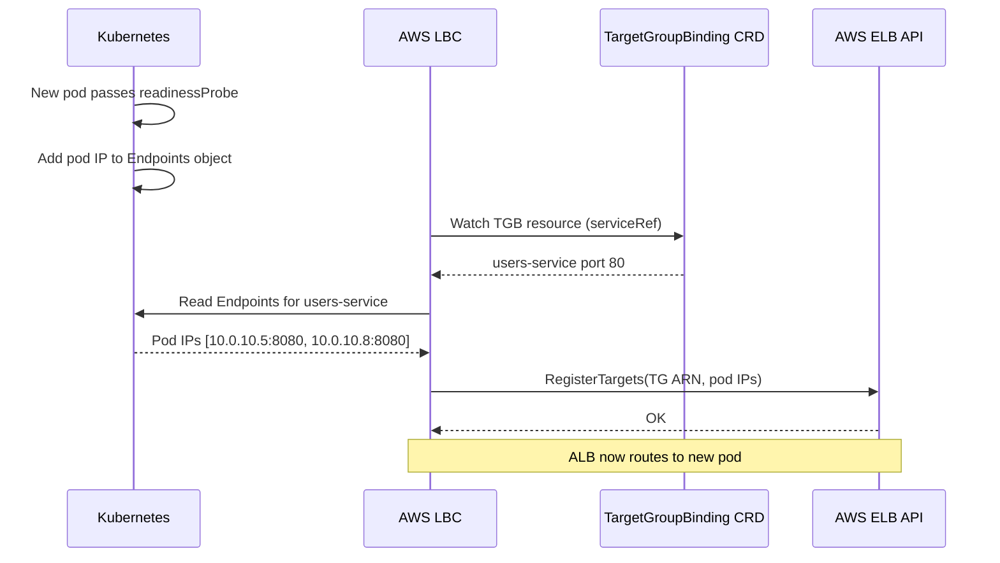
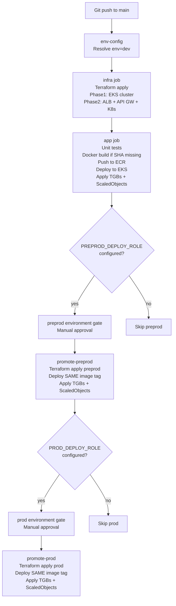
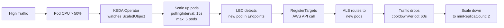
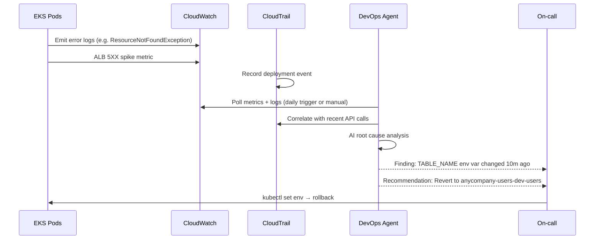

# AnyCompany Users Service

A serverless-style Users REST API built on EKS with JWT authentication, deployed to AWS via Terraform and GitHub Actions.

---

## Table of Contents

- [Architecture Overview](#architecture-overview)
- [System Flowcharts](#system-flowcharts)
- [Technology Stack](#technology-stack)
- [Repository Structure](#repository-structure)
- [Prerequisites](#prerequisites)
- [Manual Deployment Guide](#manual-deployment-guide)
- [CI/CD Pipeline](#cicd-pipeline)
- [API Reference](#api-reference)
- [Architectural Approaches & Trade-offs](#architectural-approaches--trade-offs)
- [AWS DevOps Agent](#aws-devops-agent)
- [Troubleshooting Guide](#troubleshooting-guide)

---

## Architecture Overview

```
Internet
    │
    ▼
Amazon API Gateway (REST)        ← Public HTTPS endpoint
    │   Lambda Token Authorizer  ← JWT validation via Cognito JWKS
    │
    │  VPC Link (private tunnel)
    ▼
Internal ALB                     ← Path-based routing inside VPC
  /auth/*  ──► Login Target Group  ──► login-service pods  (EKS)
  /users/* ──► Users Target Group  ──► users-service pods  (EKS)
                    ▲                          ▲
           TargetGroupBinding         TargetGroupBinding
           (AWS LBC registers         (AWS LBC registers
            pod IPs automatically)     pod IPs automatically)
    │
    ▼
Amazon DynamoDB                  ← Users table (PAY_PER_REQUEST)
Amazon Cognito User Pool         ← Auth / token issuance
Amazon ECR                       ← Container image registry

    ┌─────────────────────────────────────────────────────┐
    │  AWS DevOps Agent (AI self-healing)                 │
    │  Monitors CloudWatch Logs + Metrics + CloudTrail    │
    │  Detects anomalies → Root cause analysis → Alert    │
    └─────────────────────────────────────────────────────┘
```

### Per-Environment Isolation

Each environment (`dev`, `preprod`, `prod`) is a fully independent stack:

| Resource | dev | preprod | prod |
|---|---|---|---|
| EKS cluster | anycompany-users-dev-cluster | anycompany-users-preprod-cluster | anycompany-users-prod-cluster |
| EKS version | 1.35 | 1.37 | 1.37 |
| DynamoDB table | anycompany-users-dev-users | anycompany-users-preprod-users | anycompany-users-prod-users |
| Cognito User Pool | anycompany-users-dev-pool | anycompany-users-preprod-pool | anycompany-users-prod-pool |
| API Gateway | anycompany-users-dev-api | anycompany-users-preprod-api | anycompany-users-prod-api |
| ECR repos | shared (dev) | ← same | ← same |

---

## System Flowcharts

### Request Authentication Flow



### TargetGroupBinding Pod Registration Flow



### CI/CD Pipeline Flow



### KEDA Event-Driven Scaling Flow



### AWS DevOps Agent Self-Healing Flow



---

## Technology Stack

| Component | Technology | Version |
|---|---|---|
| IaC | Terraform | ~1.7 |
| Language | Python | 3.10 |
| Compute | Amazon EKS | 1.35 (dev) / 1.37 (preprod/prod) |
| Node type | EC2 t3.medium | managed node group |
| Database | Amazon DynamoDB | on-demand |
| API | Amazon API Gateway REST (v1) | — |
| Auth | Amazon Cognito + Lambda Authorizer | — |
| Load Balancer | AWS ALB (internal) | — |
| LB Controller | AWS Load Balancer Controller | 1.8.1 (Helm) |
| Container Registry | Amazon ECR | — |
| Networking | Single NAT GW + VPC Gateway Endpoints (S3, DynamoDB) | — |
| Autoscaling | KEDA ScaledObject | 2.16.0 (Helm) — min:2 max:5 |
| IAM for pods | EKS Pod Identity | eks-pod-identity-agent addon |
| Cluster access | EKS Access Entries API | API-only mode (aws-auth disabled) |
| AI Ops | AWS DevOps Agent | anycompany-users-firefighter |

---

## Repository Structure

```
.
├── .github/workflows/deploy.yml     # CI/CD pipeline
├── infrastructure/
│   ├── shared/                      # VPC, single NAT GW, VPC endpoints, GitHub OIDC
│   │   ├── vpc.tf                   # VPC, subnets, NAT gateway, route tables
│   │   ├── github-oidc.tf           # OIDC provider + deploy role (CloudControl perms included)
│   │   ├── main.tf
│   │   └── variables.tf
│   └── env/                         # Per-environment stack
│       ├── eks.tf                   # EKS cluster (API auth mode) + node group + Pod Identity addon
│       ├── iam.tf                   # Pod Identity roles for login-service and users-service
│       ├── lbc.tf                   # AWS LBC Helm release + Pod Identity role (wait=true)
│       ├── keda.tf                  # KEDA Helm release (depends on lbc to avoid webhook race)
│       ├── devops-agent.tf          # AWS DevOps Agent space, skill, agent, trigger
│       ├── alb.tf                   # ALB + Target Groups + Listener Rules
│       ├── api-gateway.tf           # API Gateway + OpenAPI body + Lambda integration
│       ├── cognito.tf               # Cognito User Pool + App Client
│       ├── dynamodb.tf              # DynamoDB users table
│       ├── ecr.tf                   # ECR repos (dev only, force_delete=true)
│       ├── lambda-authorizer.tf     # Lambda token authorizer + IAM
│       ├── k8s-infra.tf             # K8s namespaces, ServiceAccounts, ConfigMaps, NetworkPolicy
│       ├── vpc-link.tf              # VPC Link V2 connecting API GW to ALB
│       ├── provider.tf              # aws, awscc, kubernetes, helm, time providers
│       ├── variables.tf             # Includes eks_admin_iam_arns for console access
│       └── environments/
│           ├── dev.tfvars           # kubernetes_version=1.35, eks_admin_iam_arns=[...]
│           ├── preprod.tfvars       # kubernetes_version=1.37
│           ├── prod.tfvars          # kubernetes_version=1.37
│           └── mr.tfvars
├── k8s/
│   ├── login-deployment.yaml        # Login service Deployment (IMAGE_TAG placeholder)
│   ├── login-service.yaml           # Login service Service (NodePort)
│   ├── login-tgb.yaml               # Login TargetGroupBinding (LOGIN_TG_ARN placeholder)
│   ├── login-scaledobject.yaml      # KEDA ScaledObject — login-service (CPU 50%, min:2 max:5)
│   ├── users-deployment.yaml        # Users service Deployment
│   ├── users-service.yaml           # Users service Service (NodePort)
│   ├── users-tgb.yaml               # Users TargetGroupBinding
│   └── users-scaledobject.yaml      # KEDA ScaledObject — users-service (CPU 50%, min:2 max:5)
├── scripts/
│   ├── demo-devops-agent.sh         # DevOps Agent demo: inject failure → agent analysis → remediate
│   ├── upgrade-eks.sh               # Sequential EKS upgrade (one minor version at a time)
│   ├── teardown.sh                  # Safe teardown: remove K8s resources before terraform destroy
│   └── destroy-all.sh               # Destroy all envs in reverse order: prod → preprod → dev → shared
└── src/
    ├── login/                       # FastAPI login service
    ├── users/                       # FastAPI users service
    └── authorizer/                  # Lambda token authorizer (Python)
```

---

## Prerequisites

### Tools

```bash
terraform -version   # requires ~1.7
aws --version        # requires v2
kubectl version --client
helm version
docker --version
python3 --version    # requires 3.10+
```

### AWS Credentials

```bash
aws configure --profile anycompany
aws sts get-caller-identity
```

### Shared Infrastructure (one-time setup)

```bash
cd infrastructure/shared
terraform init
terraform apply
```

---

## Manual Deployment Guide

### Step 1 — Bootstrap Terraform backend (first time only)

```bash
aws s3 mb s3://anycompany-users-tfstate-ACCOUNT_ID --region us-east-1
aws s3api put-bucket-versioning \
  --bucket anycompany-users-tfstate-ACCOUNT_ID \
  --versioning-configuration Status=Enabled
```

### Step 2 — Set environment variables

```bash
export ENV=dev
export AWS_REGION=us-east-1
export TF_DIR=infrastructure/env
export TF_STATE_BUCKET=anycompany-users-tfstate-ACCOUNT_ID
```

### Step 3 — Build Lambda authorizer package

```bash
BUILD_DIR="/tmp/authorizer-build"
ZIP_PATH="/tmp/anycompany-authorizer-${ENV}.zip"
rm -rf "${BUILD_DIR}" && mkdir -p "${BUILD_DIR}"
pip install -r src/authorizer/requirements.txt -t "${BUILD_DIR}"
cp src/authorizer/lambda_authorizer.py "${BUILD_DIR}/"
cd "${BUILD_DIR}" && zip -qr "${ZIP_PATH}" . && cd -
```

### Step 4 — Terraform Phase 1: EKS cluster + node group

```bash
cd ${TF_DIR}

terraform init -reconfigure \
  -backend-config="key=${ENV}/terraform.tfstate" \
  -backend-config="bucket=${TF_STATE_BUCKET}" \
  -backend-config="region=${AWS_REGION}"

EKS_CLUSTER="anycompany-users-${ENV}-cluster"
EKS_ENDPOINT=$(aws eks describe-cluster --name "${EKS_CLUSTER}" \
  --query 'cluster.endpoint' --output text 2>/dev/null || echo "")
EKS_CA=$(aws eks describe-cluster --name "${EKS_CLUSTER}" \
  --query 'cluster.certificateAuthority.data' --output text 2>/dev/null || echo "")

terraform apply \
  -var-file=environments/${ENV}.tfvars \
  -var="env=${ENV}" \
  -var="eks_cluster_endpoint=${EKS_ENDPOINT}" \
  -var="eks_cluster_ca_cert=${EKS_CA}" \
  -target=aws_iam_role.eks_cluster \
  -target=aws_iam_role.eks_nodes \
  -target=aws_iam_role_policy_attachment.eks_cluster_policy \
  -target=aws_iam_role_policy_attachment.eks_worker_node \
  -target=aws_iam_role_policy_attachment.eks_cni \
  -target=aws_iam_role_policy_attachment.eks_ecr_read \
  -target=aws_eks_cluster.main \
  -target=aws_eks_node_group.main \
  -auto-approve
```

> **Note:** `aws_iam_openid_connect_provider.eks` is no longer targeted — OIDC provider was removed when migrating to Pod Identity.

### Step 5 — Wait for EKS to be ACTIVE

```bash
aws eks wait cluster-active --name "anycompany-users-${ENV}-cluster" --region ${AWS_REGION}
```

### Step 6 — Grant kubectl access (first deploy only)

If this is a brand-new cluster, grant your IAM identity cluster-admin access before Phase 2:

```bash
# Find your IAM identity
aws sts get-caller-identity --query Arn --output text
# Strip the session suffix to get the role/user ARN, then:

aws eks create-access-entry \
  --cluster-name "anycompany-users-${ENV}-cluster" \
  --principal-arn arn:aws:iam::ACCOUNT_ID:role/YOUR_ROLE \
  --type STANDARD

aws eks associate-access-policy \
  --cluster-name "anycompany-users-${ENV}-cluster" \
  --principal-arn arn:aws:iam::ACCOUNT_ID:role/YOUR_ROLE \
  --policy-arn arn:aws:eks::aws:cluster-access-policy/AmazonEKSClusterAdminPolicy \
  --access-scope type=cluster
```

> **Tip:** For persistent console access, add the ARN to `eks_admin_iam_arns` in the relevant `.tfvars` file instead.

### Step 7 — Terraform Phase 2: full apply

```bash
EKS_ENDPOINT=$(aws eks describe-cluster --name "anycompany-users-${ENV}-cluster" \
  --query 'cluster.endpoint' --output text)
EKS_CA=$(aws eks describe-cluster --name "anycompany-users-${ENV}-cluster" \
  --query 'cluster.certificateAuthority.data' --output text)

terraform apply \
  -var-file=environments/${ENV}.tfvars \
  -var="env=${ENV}" \
  -var="eks_cluster_endpoint=${EKS_ENDPOINT}" \
  -var="eks_cluster_ca_cert=${EKS_CA}" \
  -auto-approve

cd -
```

> Phase 2 installs LBC (with `wait=true`) then KEDA — order matters to avoid the LBC webhook race condition.

### Step 8 — Configure kubectl

```bash
aws eks update-kubeconfig \
  --name "anycompany-users-${ENV}-cluster" \
  --region ${AWS_REGION}

kubectl get nodes
```

### Step 9 — Build and push Docker images

```bash
aws ecr get-login-password --region ${AWS_REGION} \
  | docker login --username AWS --password-stdin \
    "$(aws sts get-caller-identity --query Account --output text).dkr.ecr.${AWS_REGION}.amazonaws.com"

IMAGE_TAG=$(git rev-parse --short=8 HEAD)

LOGIN_ECR=$(aws ecr describe-repositories \
  --repository-names anycompany-login-service \
  --query 'repositories[0].repositoryUri' --output text)
USERS_ECR=$(aws ecr describe-repositories \
  --repository-names anycompany-users-service \
  --query 'repositories[0].repositoryUri' --output text)

docker build -t "${LOGIN_ECR}:${IMAGE_TAG}" src/login/
docker push "${LOGIN_ECR}:${IMAGE_TAG}"

docker build -t "${USERS_ECR}:${IMAGE_TAG}" src/users/
docker push "${USERS_ECR}:${IMAGE_TAG}"
```

### Step 10 — Deploy to Kubernetes

```bash
NS="anycompany-users-${ENV}"

sed "s|IMAGE_TAG|${LOGIN_ECR}:${IMAGE_TAG}|g" k8s/login-deployment.yaml \
  | kubectl apply -n "${NS}" -f -
sed "s|IMAGE_TAG|${USERS_ECR}:${IMAGE_TAG}|g" k8s/users-deployment.yaml \
  | kubectl apply -n "${NS}" -f -

kubectl apply -n "${NS}" -f k8s/login-service.yaml
kubectl apply -n "${NS}" -f k8s/users-service.yaml

# KEDA ScaledObjects (replaces HPAs)
kubectl apply -n "${NS}" -f k8s/login-scaledobject.yaml
kubectl apply -n "${NS}" -f k8s/users-scaledobject.yaml

kubectl rollout status deployment/login-service -n "${NS}" --timeout=5m
kubectl rollout status deployment/users-service -n "${NS}" --timeout=5m
```

### Step 11 — Apply TargetGroupBindings

```bash
PREFIX="anycompany-users-${ENV}"

LOGIN_TG_ARN=$(aws elbv2 describe-target-groups \
  --names "${PREFIX}-login-tg" \
  --query 'TargetGroups[0].TargetGroupArn' --output text)
USERS_TG_ARN=$(aws elbv2 describe-target-groups \
  --names "${PREFIX}-users-tg" \
  --query 'TargetGroups[0].TargetGroupArn' --output text)

until kubectl get crd targetgroupbindings.elbv2.k8s.aws &>/dev/null; do
  echo "Waiting for TargetGroupBinding CRD..."; sleep 5
done

sed "s|LOGIN_TG_ARN|${LOGIN_TG_ARN}|g" k8s/login-tgb.yaml | kubectl apply -n "${NS}" -f -
sed "s|USERS_TG_ARN|${USERS_TG_ARN}|g" k8s/users-tgb.yaml | kubectl apply -n "${NS}" -f -
```

### Step 12 — Create a test user and smoke test

```bash
USER_POOL_ID=$(aws cognito-idp list-user-pools --max-results 20 \
  --query "UserPools[?Name=='anycompany-users-${ENV}-pool'].Id" --output text)

aws cognito-idp admin-create-user \
  --user-pool-id "${USER_POOL_ID}" \
  --username testuser@example.com \
  --user-attributes Name=email,Value=testuser@example.com Name=email_verified,Value=true \
  --temporary-password "Temp1234!"

aws cognito-idp admin-set-user-password \
  --user-pool-id "${USER_POOL_ID}" \
  --username testuser@example.com \
  --password "Test1234!" --permanent

API_URL=$(aws apigateway get-rest-apis \
  --query "items[?name=='anycompany-users-${ENV}-api'].id" --output text)
BASE_URL="https://${API_URL}.execute-api.${AWS_REGION}.amazonaws.com/v1"
APP_CLIENT_ID=$(aws cognito-idp list-user-pool-clients \
  --user-pool-id "${USER_POOL_ID}" --max-results 1 \
  --query 'UserPoolClients[0].ClientId' --output text)

TOKEN=$(curl -s -X POST "${BASE_URL}/auth/login" \
  -H "Content-Type: application/json" \
  -d "{\"email\":\"testuser@example.com\",\"password\":\"Test1234!\",\"client_id\":\"${APP_CLIENT_ID}\"}" \
  | python3 -c "import sys,json; print(json.load(sys.stdin)['access_token'])")

curl -s -X POST "${BASE_URL}/users" \
  -H "Authorization: Bearer ${TOKEN}" \
  -H "Content-Type: application/json" \
  -d '{"email":"alice@example.com","name":"Alice"}' | python3 -m json.tool

curl -s "${BASE_URL}/users" -H "Authorization: Bearer ${TOKEN}" | python3 -m json.tool
```

---

## CI/CD Pipeline

| Job | Trigger | Description |
|---|---|---|
| `env-config` | always | Resolves `env` and `tfvars_file` from branch/PR |
| `infra` | push/PR | Terraform apply (Phase 1: EKS, Phase 2: everything else) |
| `app` | after infra | Unit tests → ECR build → EKS deploy → TGBs + ScaledObjects |
| `check-preprod` | after app | Checks if `PREPROD_DEPLOY_ROLE_ARN` secret exists |
| `promote-preprod` | manual gate | Terraform + same image deploy to preprod |
| `check-prod` | after preprod | Checks if `PROD_DEPLOY_ROLE_ARN` secret exists |
| `promote-prod` | manual gate | Terraform + same image deploy to prod |
| `teardown-mr` | PR closed | `terraform destroy` for MR ephemeral env |

### Required GitHub Secrets

| Secret | Description |
|---|---|
| `NONPROD_DEPLOY_ROLE_ARN` | IAM role for dev/MR deploys (needs CloudControl API perms for awscc provider) |
| `TF_STATE_BUCKET` | S3 bucket for dev/MR Terraform state |
| `PREPROD_DEPLOY_ROLE_ARN` | IAM role for preprod (optional) |
| `PREPROD_TF_STATE_BUCKET` | S3 bucket for preprod state |
| `PROD_DEPLOY_ROLE_ARN` | IAM role for prod (optional) |
| `PROD_TF_STATE_BUCKET` | S3 bucket for prod state |

---

## API Reference

All protected endpoints require `Authorization: Bearer <access_token>` header.

| Method | Path | Auth | Description |
|---|---|---|---|
| POST | `/auth/login` | None | Login with email + password, returns tokens |
| POST | `/auth/refresh` | None | Refresh access token |
| POST | `/auth/logout` | None | Invalidate refresh token |
| GET | `/users` | Required | List users (supports `limit`, `next_token`) |
| POST | `/users` | Required | Create user |
| GET | `/users/{user_id}` | Required | Get user by ID |
| PUT | `/users/{user_id}` | Required | Update user |
| DELETE | `/users/{user_id}` | Required | Delete user |

---

## Architectural Approaches & Trade-offs

### Load Balancing: Three Options

#### Option A — Current: AWS ALB + TargetGroupBinding

```
API Gateway → VPC Link → ALB → pods (via TGB IP registration)
```

- AWS LBC watches TargetGroupBinding CRDs and calls `RegisterTargets` / `DeregisterTargets` as pods come and go
- Fully managed by AWS — no sidecar pods, ACM certificates, WAF, access logs built-in
- **Limitation:** AWS-only; advanced traffic policies need ALB annotations

#### Option B — AWS LBC + Gateway API (future-proof)

```
API Gateway → VPC Link → ALB (managed by K8s Gateway API HTTPRoute) → pods
```

- Same ALB data plane, routing via standard K8s `HTTPRoute` resources
- AWS LBC v2.7+ supports Gateway API natively
- Kubernetes Ingress API is frozen; Gateway API is the official successor

#### Option C — Envoy Gateway (cloud-portable)

```
API Gateway → VPC Link → NLB → Envoy Gateway pods → pods
```

- Full traffic management: weight-based routing, retries, circuit breaking via `BackendTrafficPolicy`
- Cloud-portable: same manifests on GKE, AKS, or on-prem
- Requires running Envoy pods and NLB; higher operational overhead

| Factor | ALB + TGB | ALB + Gateway API | Envoy Gateway |
|---|---|---|---|
| AWS integration | Native | Native | Manual |
| K8s standard | Legacy Ingress | Gateway API | Gateway API |
| Advanced traffic control | Annotations only | Partial | Full |
| Operational overhead | Low | Low | Medium |
| Cloud portability | AWS only | AWS only | Any cloud |

### NAT Gateway Options

| Option | Cost | AZ Fault Tolerance | Current |
|---|---|---|---|
| Single NAT (one AZ) | Lowest | No — single point of failure | **Yes** |
| Per-AZ Zonal NATs | 2-3× cost | Yes — each AZ uses local NAT | No |
| AWS PrivateLink endpoints | Per-call pricing | N/A (service-level HA) | S3 + DynamoDB only |

> Current choice: single NAT + VPC Gateway Endpoints for S3/DynamoDB (free). DynamoDB and S3 traffic never hits the NAT.

### IAM for Pods: Pod Identity vs IRSA

| Factor | IRSA (old) | Pod Identity (current) |
|---|---|---|
| Setup per cluster | Requires per-cluster OIDC provider | No OIDC provider needed |
| Trust policy principal | `oidc.eks.amazonaws.com/id/<HASH>` | `pods.eks.amazonaws.com` |
| Terraform resource | `aws_iam_openid_connect_provider` | `aws_eks_pod_identity_association` |
| Token refresh | Via OIDC | Via Pod Identity Agent DaemonSet |
| Multi-cluster support | Separate OIDC per cluster | Same role, multiple associations |

Pod Identity is the AWS-recommended approach for EKS 1.24+. Roles use `sts:AssumeRole` + `sts:TagSession`.

### Autoscaling: KEDA vs HPA

| Factor | HPA | KEDA (current) |
|---|---|---|
| Trigger types | CPU, memory only | CPU, memory, SQS, DynamoDB streams, Prometheus, cron, custom |
| Kubernetes resource | `HorizontalPodAutoscaler` | `ScaledObject` CRD |
| Scale-to-zero | No (min 1) | Yes |
| External metrics | Requires metrics adapter | Built-in via KEDA scalers |
| Helm chart | Not needed | `kedacore/keda` 2.16.0 |

Current `ScaledObject` config: CPU 50% trigger, min 2, max 5, pollingInterval 15s, cooldownPeriod 60s.

### EKS Cluster Access: Access Entries vs aws-auth ConfigMap

| Factor | aws-auth ConfigMap (deprecated) | EKS Access Entries (current) |
|---|---|---|
| Stored in | Kubernetes ConfigMap | AWS API |
| Modify via | kubectl (needs existing cluster access) | AWS CLI / Terraform |
| Lock-out risk | High — bad YAML = full lockout | None — AWS API always available |
| CloudTrail audit | No | Yes |
| Recovery if creator leaves | Contact AWS Support | Any IAM admin with `eks:CreateAccessEntry` |
| Terraform resource | Manual `null_resource` or `kubernetes_config_map` | `aws_eks_access_entry` + `aws_eks_access_policy_association` |

Current auth mode: `API` (aws-auth fully disabled). Access managed via `eks_admin_iam_arns` in `.tfvars`.

### DynamoDB Capacity Modes

| Mode | Use case | Current |
|---|---|---|
| PAY_PER_REQUEST | Unpredictable / spiky traffic | **Yes** |
| PROVISIONED + Auto Scaling | Stable, high-volume traffic | No |
| PROVISIONED + DAX | Microsecond read latency needed | No |

---

## AWS DevOps Agent

The **anycompany-users-firefighter** agent monitors the service for anomalies, performs AI-powered root cause analysis, and surfaces remediation recommendations.

### What it monitors

- CloudWatch Logs: `ResourceNotFoundException`, `AccessDeniedException`, `CrashLoop` patterns
- CloudWatch Metrics: ALB 5XX rate, pod restart count, DynamoDB throttle count
- CloudTrail: Recent deployment events (env var changes, image updates)
- ELB Target Health: Unhealthy target counts

### Triggering the agent

The agent runs on a daily schedule. To trigger manually:

```bash
AGENT_SPACE_ID=$(cd infrastructure/env && terraform output -raw devops_agent_space_id)

aws aidevops start-agent-run \
  --agent-space-id "$AGENT_SPACE_ID" \
  --region us-east-1
```

Or open the console:
```
https://us-east-1.console.aws.amazon.com/devops-agent/home?region=us-east-1
```

### Demo scenario

The `scripts/demo-devops-agent.sh` script runs a complete failure-detection-remediation cycle:

```bash
./scripts/demo-devops-agent.sh
```

**What it does:**
1. **Inject failure** — patches `users-service` with `TABLE_NAME=wrong-table-does-not-exist`
2. **Observe** — pods stay Running (health check passes) but API calls fail with `AccessDeniedException` — a silent runtime failure that metrics alone won't catch
3. **Trigger agent** — invokes the DevOps Agent to correlate logs + metrics + CloudTrail
4. **Remediate** — restores the correct table name, waits for rollout, verifies ALB targets go healthy

**Why this failure is realistic:** Pods pass Kubernetes health checks but the application silently fails on every business request. The error only appears in CloudWatch Logs. The agent correlates the log pattern with a CloudTrail `UpdateDeployment` event from 10 minutes earlier to pinpoint root cause.

### IAM permissions required

The GitHub deploy role (`anycompany-users-github-nonprod-deploy`) includes:
- `cloudformation:GetResource` + related Cloud Control API actions (used by `awscc` provider)
- `aidevops:*` (DevOps Agent API)

---

## Troubleshooting Guide

### 1. EKS nodes fail to join cluster — `NodeCreationFailure: Instances failed to join`

**Symptom:** `aws eks describe-nodegroup` shows `status: CREATE_FAILED` with `NodeCreationFailure`.

**Root cause:** Private subnets have no internet route. Nodes need outbound internet to reach the EKS API endpoint and pull ECR images during bootstrap. This happens when the NAT gateway was not created before the node group, or when shared infra was partially torn down and the route tables lost their NAT route.

**Diagnosis:**
```bash
# Check if the private route table has a NAT route
RT_ID=$(aws ec2 describe-route-tables \
  --filters "Name=tag:Name,Values=*nonprod-private-rt*" \
  --query 'RouteTables[0].RouteTableId' --output text)
aws ec2 describe-route-tables --route-table-ids "$RT_ID" \
  --query 'RouteTables[0].Routes'
# Must have a route with NatGatewayId — if missing, shared infra apply failed
```

**Resolution:**
```bash
# 1. Apply shared infra first
cd infrastructure/shared && terraform apply

# 2. Delete the failed node group
terraform destroy -target=aws_eks_node_group.main \
  -var-file=environments/dev.tfvars -var="env=dev" \
  -var="eks_cluster_endpoint=" -var="eks_cluster_ca_cert=" -auto-approve

# 3. Recreate it
terraform apply -target=aws_eks_node_group.main \
  -var-file=environments/dev.tfvars -var="env=dev" \
  -var="eks_cluster_endpoint=$EKS_ENDPOINT" -var="eks_cluster_ca_cert=$EKS_CA" -auto-approve
```

---

### 2. AWS console shows `Unauthorized` for K8s resources

**Symptom:** EKS console → Resources tab shows "Error loading resources: Unauthorized".

**Root cause:** The IAM identity used by the console is not in the cluster's EKS access entries. The cluster uses `API` auth mode — aws-auth ConfigMap is disabled.

**Diagnosis:**
```bash
# Find the console identity (strip session suffix from assumed-role ARN)
# arn:aws:sts::123:assumed-role/WSParticipantRole/Participant
#   → arn:aws:iam::123:role/WSParticipantRole

aws eks list-access-entries --cluster-name anycompany-users-dev-cluster
```

**Resolution:**
```bash
aws eks create-access-entry \
  --cluster-name anycompany-users-dev-cluster \
  --principal-arn arn:aws:iam::ACCOUNT_ID:role/YOUR_ROLE \
  --type STANDARD

aws eks associate-access-policy \
  --cluster-name anycompany-users-dev-cluster \
  --principal-arn arn:aws:iam::ACCOUNT_ID:role/YOUR_ROLE \
  --policy-arn arn:aws:eks::aws:cluster-access-policy/AmazonEKSClusterAdminPolicy \
  --access-scope type=cluster
```

Then make it permanent by adding the ARN to `eks_admin_iam_arns` in the `.tfvars` file.

---

### 3. KEDA install fails — `no endpoints available for service aws-load-balancer-webhook-service`

**Symptom:** `helm_release.keda` fails with `Internal error: failed calling webhook "mservice.elbv2.k8s.aws"`.

**Root cause:** KEDA creates internal Services during install. The LBC mutating webhook intercepts all Service objects, but the LBC pods weren't ready yet when KEDA tried to install.

**Resolution:** The LBC helm release now has `wait = true` and KEDA `depends_on = [helm_release.lbc]`. If you hit this manually, just re-run apply — LBC pods will be ready:

```bash
# Verify LBC pods are Running before retrying
kubectl get pods -n kube-system -l app.kubernetes.io/name=aws-load-balancer-controller
terraform apply ...  # re-run
```

---

### 4. Terraform forces EKS cluster replacement — `bootstrap_self_managed_addons forces replacement`

**Symptom:** `terraform plan` shows `aws_eks_cluster.main must be replaced` due to `bootstrap_self_managed_addons = false -> true`.

**Root cause:** EKS 1.25+ clusters created without specifying `bootstrap_self_managed_addons` get `false` by default. Terraform's default is `true`, causing drift.

**Resolution:** Pin the value to match what EKS created:
```hcl
resource "aws_eks_cluster" "main" {
  bootstrap_self_managed_addons = false
  access_config {
    authentication_mode                         = "API"
    bootstrap_cluster_creator_admin_permissions = true
  }
  ...
}
```

---

### 5. `awscc_devopsagent_agent_space` fails — `cloudformation:GetResource AccessDeniedException`

**Symptom:** Pipeline fails with `User ... is not authorized to perform: cloudformation:GetResource`.

**Root cause:** The `awscc` Terraform provider uses the CloudFormation Cloud Control API under the hood. The deploy role was missing the `cloudformation:*Resource` permission set.

**Resolution:** Add to `infrastructure/shared/github-oidc.tf` deploy role policy:
```hcl
{
  Sid    = "CloudControlAPI"
  Effect = "Allow"
  Action = [
    "cloudformation:GetResource",
    "cloudformation:CreateResource",
    "cloudformation:UpdateResource",
    "cloudformation:DeleteResource",
    "cloudformation:ListResources",
    "cloudformation:GetResourceRequestStatus",
  ]
  Resource = "*"
},
{
  Sid    = "DevOpsAgent"
  Effect = "Allow"
  Action = ["aidevops:*"]
  Resource = "*"
}
```

---

### 6. TGB pods not registering — `BackendNotFound: unable to find port 8080 on service`

**Symptom:** `kubectl describe targetgroupbinding -n <ns>` shows BackendNotFound.

**Root cause:** `spec.serviceRef.port` must match the Service's `spec.ports[].port` (80), not the pod's `containerPort` (8080).

**Resolution:**
```yaml
spec:
  serviceRef:
    port: 80   # Service port, not containerPort
```

---

### 7. GET /users returns 403 after successful login

**Symptom:** POST /auth/login returns 200 but GET /users returns 403.

**Root cause:** Lambda authorizer TTL cache scoped the policy to the exact `methodArn` of the first call. GET /users has a different method ARN than POST /auth/login.

**Resolution:** Return a wildcard ARN from the authorizer:
```python
arn_parts = event["methodArn"].split(":")
api_stage = "/".join(arn_parts[5].split("/")[:2])
wildcard_arn = ":".join(arn_parts[:5]) + ":" + api_stage + "/*"
return _generate_policy("user", "Allow", wildcard_arn)
```

---

### 8. Login returns 401 after Cognito user creation

**Root cause:** `admin-create-user` puts users in `FORCE_CHANGE_PASSWORD` state — unusable with `USER_PASSWORD_AUTH`.

**Resolution:**
```bash
aws cognito-idp admin-set-user-password \
  --user-pool-id <POOL_ID> --username user@example.com \
  --password "Test1234!" --permanent
```

---

### 9. VPC Link — API Gateway returns 503

**Symptom:** All API calls return 503.

**Root cause:** ALB security group doesn't allow inbound port 80 from VPC Link security group.

**Diagnosis:**
```bash
aws ec2 describe-security-groups \
  --filters "Name=group-name,Values=anycompany-users-${ENV}-alb-sg" \
  --query 'SecurityGroups[0].IpPermissions'
```

---

### 10. KEDA ScaledObject not scaling — check status

```bash
# Check ScaledObject status
kubectl describe scaledobject users-service-scaledobject -n anycompany-users-dev

# Check KEDA operator logs
kubectl logs -n keda -l app=keda-operator --tail=50

# Current metric value
kubectl get hpa -n anycompany-users-dev  # KEDA creates an HPA internally
```

For load testing inside the cluster (external load won't drive CPU high enough due to network I/O dominance):
```bash
kubectl run -n anycompany-users-dev load-test --image=busybox --restart=Never -- \
  /bin/sh -c "while true; do wget -qO- http://users-service/users; done"

kubectl get pods -n anycompany-users-dev -w   # watch scale-up
kubectl delete pod load-test -n anycompany-users-dev
```

---

### General Diagnostic Commands

```bash
# Pod status and logs
kubectl get pods -n anycompany-users-dev
kubectl logs -n anycompany-users-dev -l app=users-service --tail=50

# TGB status
kubectl describe targetgroupbinding users-tgb -n anycompany-users-dev

# KEDA ScaledObject status
kubectl describe scaledobject users-service-scaledobject -n anycompany-users-dev

# ALB target health
aws elbv2 describe-target-health \
  --target-group-arn $(aws elbv2 describe-target-groups \
    --names anycompany-users-dev-users-tg \
    --query 'TargetGroups[0].TargetGroupArn' --output text) \
  --query 'TargetHealthDescriptions[*].{IP:Target.Id,State:TargetHealth.State}'

# EKS access entries
aws eks list-access-entries --cluster-name anycompany-users-dev-cluster

# API Gateway logs
aws logs tail /aws/apigateway/anycompany-users-dev --follow

# Lambda authorizer logs
aws logs tail /aws/lambda/anycompany-users-dev-token-authorizer --follow

# Node group health
aws eks describe-nodegroup \
  --cluster-name anycompany-users-dev-cluster \
  --nodegroup-name anycompany-users-dev-nodes \
  --query 'nodegroup.{status:status,health:health}'

# DevOps Agent runs
AGENT_ID=$(cd infrastructure/env && terraform output -raw devops_agent_space_id)
aws aidevops list-agent-runs --agent-space-id "$AGENT_ID" --region us-east-1
```
